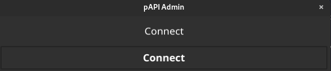
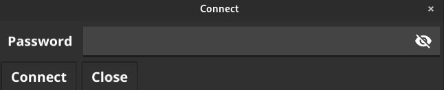
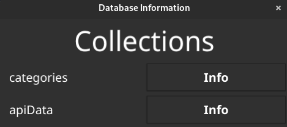

# Admin App

This is a simple application that was developed to make it easier to interact with our data. It does this by automatically connecting to our pAPI database located in MongoDB - all that it requires is the user to enter the password for the `db_admin` user. From this application, all the CRUD operations that are relevant to our database are allowed, with some simple error checking to minimise human error during data entry.

## CRUD Operations

There are numerous Create, Read, Update and Delete operations that this application makes availale. There is basic data validation implemented by default on these operations to stop the user from making a change that would result in corrupt data that won't map properly to the models defined in the backend application.

### **Categories**

Following are the CRUD operations for the `Categories` collection.

#### **Create Category**

There is a button in the `category` window that provides functionality to add a new category. This is a form that allows entry for three things:

- Name
- Short Description
- Long Description

The `ID` field is automatically generated for the user

#### **Read Category**

All categories are displayed as accordion items in the `categories` window. The fields that are displayed are:

- ID
- Name
- Short Description
- Long Description

#### **Update Category**

Be careful when modifying data, you can mess up the appication!

The categories displayed in the `categories` window are data entry fields. These can be modified, and when the update button is clicked, these changes will be applied. The fields displayed are the same as the [Read Category](#read-category) section, but the fields that are actually modified on update are the same as the [Create Category](#create-category) section. This is because Mongo doesn't allow modifying the ID field.

#### **Delete Category**

Be careful when modifying data, you can mess up the application!

A category can be removed by pressing the `Delete` button inside a category accordion. The result is simple - the category is deleted from the database.

### **API Data**

Following are the CRUD operations for the `apiData` collection.

#### **Create API Data**

There is a button in the `API Data` window that provides functionality to add a new category. This is a form that allows entry for three things:

- Title
- Description
- External URL
- Base URL

The following fields are automatically generated for the user:

- ID
- Categories
- Daily Count
- Weekly Count
- Monthly Count
- Yearly Count
- Total Count
- Requests Array
- Categories Array

There is also the ability to add new `Requests` and `Categories` to an individual set of `API Data`, since these are arrays. To add a new request, open the `Requests` accordion and click the button labelled **New Request**. The available fields for a new request are:

- URL

These request fields are automatically generated for the user:

- Last Update
- Response

To add a new category, open the `Categories` accordion and click **New Category**. The available fields for a new category are:

- Category Hex

Please note that the hex value must match the hex value of a category stored in the database, or an error will be shown.

#### **Read API Data**

All API data is displayed as accordion items in the `API Data` window. The fields that are displayed are:

- ID
- Title
- Description
- External URL
- Base URL
- Requests (Accordion)
- Categories (Accordion)

#### **Update API Data**

Be careful when modifying data, you can mess up the appication!

The API data displayed in the `API Data` window are data entry fields. These can be modified, and when the update button in the main window is clicked, these changes will be applied. The fields displayed are the same as the [Read API Data](#read-api-data) section, but the fields that are actually modified on update are the same as the form fields in the [Create API Data](#create-api-data) section. This is because Mongo doesn't allow modifying the ID field, and these other values are calculated based off client interaction with the site.

#### **Delete API Data**

Be careful when modifying data, you can mess up the application!

A set of API data can be removed by pressing the `Delete` button inside an API Data accordion. The result is simple - the set of API data is deleted from the database. Be careful with this, it's a pain to enter all the necessary information again if you accidentally delete something.

## Technologies

This application was developed using [Fyne](https://fyne.io/), a GUI framework for [Go](https://go.dev/). This was chosen because it is quick to develop a simple, offline GUI app, similar to Windows Forms in C#. We chose to develop the application offline, and run it as a desktop app for security, since the application provides admin level access to a database. Also, because the database shouldn't require constant administration, it isn't necessary for this admin application to be running 24/7, and can just be started up when a modification is necessary.

## Future Maintenance

Currently, the functionality of the application should all be fine, but when making a change to the database, the windows don't automatically refresh with the most up to date information. A change that would improve the quality of life would be implementing the automatic refresh of the window when a change is detected. However, this isn't a necessary feature, since the target user of this application is an administrator, not a customer, and therefore the application doesn't necessarily need a positive user experience, as long as the necessary functionality is there.

## Firewall Considerations

This application directly connects to MongoDB. During development there were issues accessing the database through PEAP protected nectworks, such as Eduroam. If you are having issues connecting, please try and use an external network, such as mobile data. If the error continues persisting, contact the app developer.

## Tutorial

Step 1 - Download and run the [papiAdmin](builds) application. If you're on WIndows there may be issues with the Firewall, but rest assured this is not a virus. Just allow it to run.

Step 2 - Click `Connect`.

Step 3 - Enter the password for the `db_admin` user of the `papi_db` database.

Step 4 - That's it! You are now connected to the database and can manipulate the collections within. See the previous documentation for the available CRUD operations.

